# Reinforced Frog

Jumper Frog in python with AI reinforcement 🐸

## Status

| Branch | Quality Gate                                                                                                                                                                                                                                                                                              | Bugs                                                                                                                                                                                                                                                                               | Vulnerabilities                                                                                                                                                                                                                                                                                          | Code Smells                                                                                                                                                                                                                                                                                      | Reliability                                                                                                                                                                                                                                                                                                    | Security                                                                                                                                                                                                                                                                                                 | Maintainability                                                                                                                                                                                                                                                                                              | Technical Debt                                                                                                                                                                                                                                                                                      |
|--------|-----------------------------------------------------------------------------------------------------------------------------------------------------------------------------------------------------------------------------------------------------------------------------------------------------------|------------------------------------------------------------------------------------------------------------------------------------------------------------------------------------------------------------------------------------------------------------------------------------|----------------------------------------------------------------------------------------------------------------------------------------------------------------------------------------------------------------------------------------------------------------------------------------------------------|--------------------------------------------------------------------------------------------------------------------------------------------------------------------------------------------------------------------------------------------------------------------------------------------------|----------------------------------------------------------------------------------------------------------------------------------------------------------------------------------------------------------------------------------------------------------------------------------------------------------------|----------------------------------------------------------------------------------------------------------------------------------------------------------------------------------------------------------------------------------------------------------------------------------------------------------|--------------------------------------------------------------------------------------------------------------------------------------------------------------------------------------------------------------------------------------------------------------------------------------------------------------|-----------------------------------------------------------------------------------------------------------------------------------------------------------------------------------------------------------------------------------------------------------------------------------------------------|
| Main   | [](https://sonar.nospy.fr/dashboard?id=Nouuu_reinforced-frog_AYNkrhosm-3jSFiMinj1&branch=main) | [](https://sonar.nospy.fr/dashboard?id=Nouuu_reinforced-frog_AYNkrhosm-3jSFiMinj1&branch=main) | [](https://sonar.nospy.fr/dashboard?id=Nouuu_reinforced-frog_AYNkrhosm-3jSFiMinj1&branch=main) | [](https://sonar.nospy.fr/dashboard?id=Nouuu_reinforced-frog_AYNkrhosm-3jSFiMinj1&branch=main) | [](https://sonar.nospy.fr/dashboard?id=Nouuu_reinforced-frog_AYNkrhosm-3jSFiMinj1&branch=main) | [](https://sonar.nospy.fr/dashboard?id=Nouuu_reinforced-frog_AYNkrhosm-3jSFiMinj1&branch=main) | [](https://sonar.nospy.fr/dashboard?id=Nouuu_reinforced-frog_AYNkrhosm-3jSFiMinj1&branch=main) | [](https://sonar.nospy.fr/dashboard?id=Nouuu_reinforced-frog_AYNkrhosm-3jSFiMinj1&branch=main) |
| Dev    | [](https://sonar.nospy.fr/dashboard?id=Nouuu_reinforced-frog_AYNkrhosm-3jSFiMinj1)                         | [](https://sonar.nospy.fr/dashboard?id=Nouuu_reinforced-frog_AYNkrhosm-3jSFiMinj1)                         | [](https://sonar.nospy.fr/dashboard?id=Nouuu_reinforced-frog_AYNkrhosm-3jSFiMinj1)                         | [](https://sonar.nospy.fr/dashboard?id=Nouuu_reinforced-frog_AYNkrhosm-3jSFiMinj1)                         | [](https://sonar.nospy.fr/dashboard?id=Nouuu_reinforced-frog_AYNkrhosm-3jSFiMinj1)                         | [](https://sonar.nospy.fr/dashboard?id=Nouuu_reinforced-frog_AYNkrhosm-3jSFiMinj1)                         | [](https://sonar.nospy.fr/dashboard?id=Nouuu_reinforced-frog_AYNkrhosm-3jSFiMinj1)                         | [](https://sonar.nospy.fr/dashboard?id=Nouuu_reinforced-frog_AYNkrhosm-3jSFiMinj1)                         |

|                                                             |                                            |
|-------------------------------------------------------------|--------------------------------------------|
|  | 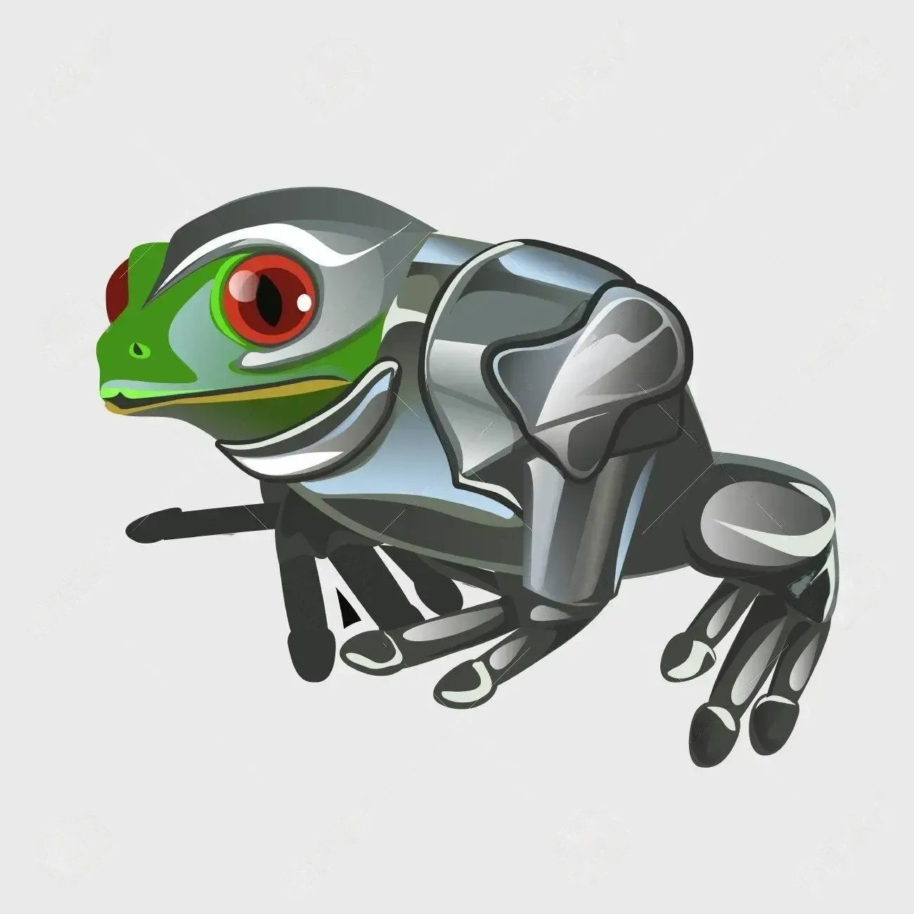 |

## Présentation du jeu et Objectif

L'objectif principal est de faire apprendre par renforcement un agent sur le jeu Frogger.

### Contexte

Ce projet a été réalisé dans le cadre du cours d'apprentissage par renforcement. Il a été réalisé par 3 étudiants en
5ᵉ année d'architecture logicielle.

### Frogger original

| Règles du jeu                                                                                                                                                                                                                                                                                                                                                                         | Jeu original                                            |
|---------------------------------------------------------------------------------------------------------------------------------------------------------------------------------------------------------------------------------------------------------------------------------------------------------------------------------------------------------------------------------------|---------------------------------------------------------|
| Frogger est un jeu d'arcade classique. Le but du jeu est de diriger des grenouilles jusqu'à leurs maisons. Pour cela, le joueur doit d'abord traverser une route en évitant des voitures qui roulent à différentes vitesses puis une rivière aux courants changeants et enfin, à nouveaux une route. La grenouille meurt si elle touche une voiture ou si elle tombe dans la rivière. | 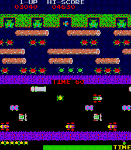 |

### Objectif

L'objectif est de faire apprendre à un agent à traverser la route et la rivière en évitant les voitures et l'eau.
Pour cela, nuos allons utiliser l'algorithme `Q-Learning`. L'agent va apprendre à traverser la route et la rivière en
apprenant à associer une action à un état. L'agent va donc apprendre à associer une action à un état.

Pour cela, nous allons également devoir développer le jeu Frogger en utilisant la
librairie [`arcade`](https://api.arcade.academy/en/latest/). Le seul langage
utilisé est le Python, nous n'utilisons pas de librairie externe mis à part arcade et quelques librairies utilitaires.

## Installation

### Prérequis

## Utilisation

### Environnement

## Développement du jeu

### Présentation de la librairie arcade

[`Arcade`](https://api.arcade.academy/en/latest/) est une librairie Python permettant de créer des jeux vidéo. Elle est
basée sur Pyglet et permet de créer des jeux vidéo 2D. Elle permet de créer des jeux vidéo en 2D avec des sprites, des
animations, des sons, des effets de particules, ...

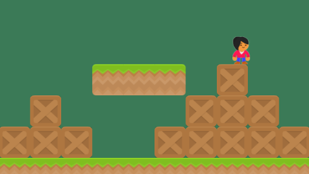

### Configuration des règles

Afin de pouvoir modifier rapidement la configuration de notre jeu (difficulté, tokens, actions possibles, ...), nous
avons
écrit toute la configuration dans le fichier [`config.py`](./conf/config.py). Ce fichier est lu par le jeu.

#### Tokens

Ce fichier de configuration contient les différents tokens utilisés dans le jeu. Ces derniers permettent au jeu d'avoir
une représentation textuelle de son environement, ce qui va grandement nous aider pour l'apprentissage de l'agent.

```python
CAR_TOKEN = 'C'
TRUCK_TOKEN = 'Z'
TURTLE_TOKEN = 'T'
TURTLE_L_TOKEN = 'TL'
TURTLE_XL_TOKEN = 'TXL'
REVERSED_CAR_TOKEN = 'RC'
REVERSED_TRUCK_TOKEN = 'RZ'
REVERSED_TURTLE_TOKEN = 'RT'
REVERSED_TURTLE_L_TOKEN = 'RTL'
...

ACTION_UP = 'U'
ACTION_DOWN = 'D'
ACTION_LEFT = 'L'
ACTION_RIGHT = 'R'
ACTION_NONE = 'N'
...

WATER_COMMONS_TOKENS = [TURTLE_TOKEN, TURTLE_L_TOKEN, TURTLE_XL_TOKEN, REVERSED_TURTLE_TOKEN, REVERSED_TURTLE_L_TOKEN,
                        ...]
...

WIN_STATES = [EXIT_TOKEN]

```

#### Arcade

Ce fichier de configuration contient les différents paramètres de la librairie arcade. Ces derniers permettent de
définir les sprites des différentes entités, ainsi que leur taille et le scaling.

```python
SCALE = 1
SPRITE_SIZE = 64 * SCALE

...


def get_sprite_resources(name: str, sprite_size: float = 0.5):
  return arcade.Sprite(f":resources:images/{name}.png", sprite_size * SCALE)


def get_sprite_local(name: str, sprite_size: float = 0.5):
  return arcade.Sprite(f"assets/sprite/{name}.png", sprite_size * SCALE)


ENTITIES: Dict[str, WorldEntity] = {
  CAR_TOKEN: WorldEntity(1, 1, CAR_TOKEN, get_sprite_local("car_1", 0.65)),
  ...
}

...

WORLD_WIDTH = 180
WORLD_HEIGHT = 117
WORLD_SCALING = 9
```

### Représentation du monde

Le monde est représenté par une matrice de caractères. Chaque caractère représente une entité du monde. Les entités
sont représentées par des tokens. Ces derniers sont définis dans le fichier de configuration.

La classe permettant de représenter le monde est la classe [`World`](./game/world.py). Cette classe permet de

Cette dernière permet de :

- Créer un monde, avec la bonne configuration
- Gérer la mise à jour (déplacement) des entités dans le monde
- Gérer les collisions entre les entités
- Gérer les mouvements, récompenses des joueurs

#### Représentation du monde pour l'agent

A chaque état, l'agent reçoit une représentation du monde sous forme de liste de chaîne caractères. Chaque élément
représente une ligne visible ( définit dans les variables d'environnement) du monde.

Ainsi, l'agent ne voit pas toute la carte, mais tout au plus 2 ligne devant lui, 1 ligne derrière lui, et 4 colonnes sur
les côtés.

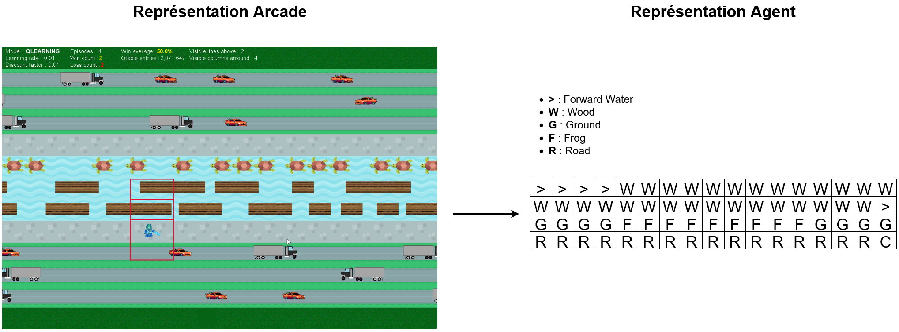

#### World Entity

Pour généraliser les différentes entités que nous traitons, nous avons la
classe [`WorldEntity`](./display/entity/world_entity.py).
Cette dernière permet de regrouper pour chaques entités :

- La taille de l'entité
- Le token de l'entité
- Le sprite de l'entité

#### World Line

La classe [`WorldLine`](./display/entity/world_line.py) permet de représenter une ligne du monde. Cette dernière permet
de gérer les déplacements des entités sur chaque ligne, ainsi que leur fréquence d'apparition, vitesse, ...

### Joueurs

Le joueur est représenté par l'interface [`Player`](./game/Player.py). Cette dernière permet de gérer le déplacement du
joueur, de le gérer dans la classe principale `Game`. Cette interface nous permet de gérer plusieurs types de joueurs (
Humain, Agent).

```python
from typing import Tuple, List

from arcade import Sprite

from display.entity.world_entity import WorldEntity
from game.world import World


class Player:
  def init(self, world: World, intial_state: Tuple[int, int], _initial_environment: bytes):
    pass

  def best_move(self, environment: [str]) -> str:
    pass

  def step(self, action: str, reward: float, new_state: Tuple[int, int], _environment: List[str]):
    pass

  def save_score(self):
    pass

  def update_state(self, new_state, new_environment):
    pass

  @property
  def sprite(self) -> Sprite:
    pass

  @property
  def world_entity(self) -> WorldEntity:
    pass

  @property
  def is_human(self) -> bool:
    pass

  @property
  def score(self) -> int:
    pass

  @property
  def state(self) -> Tuple[int, int]:
    pass
```

#### Joueur Humain

Le joueur humain est représenté par la classe [`HumanPlayer`](./game/HumanPlayer.py). Cette dernière permet de se
déplacer avec les touches directionnelles du clavier.

### Affichage graphique

L'affichage graphique est entièrement géré par la classe [`WorldWindow`](./display/world_window.py). Cette dernière
permet de gérer l'affichage du monde sur arcade. Elle permet également de gérer la vitesse de jeu, le nombre de frames
par seconde, les statistiques affichés, ...

```python
import arcade.color

from ai.Model import Model
from conf.config import *
from game.game import Game


class WorldWindow(arcade.Window):
  def __init__(self, game: Game, env, model: Model):
    super().__init__(
      int(game.world.width / WORLD_SCALING * SPRITE_SIZE),
      int(game.world.height / WORLD_SCALING * SPRITE_SIZE),
      'REINFORCED FROG',
      update_rate=1 / 60
    )
    self.__height = int(game.world.height / WORLD_SCALING * SPRITE_SIZE)

  # ...

  # ...

  def setup(self):
    self.setup_world_states()
    self.setup_players_states()
    self.setup_world_entities_state()

  def setup_world_entities_state(self):
    self.__entities_sprites = arcade.SpriteList()
    for state in self.__game.world.world_entities_states.keys():
      world_entity: WorldEntity = self.__game.world.get_world_entity(state)
      if world_entity is not None:
        sprite = self.__get_entity_sprite(state, world_entity)
        self.__entities_sprites.append(sprite)

  def setup_world_states(self):
    self.__world_sprites = arcade.SpriteList()
    for state in self.__game.world.world_states:
      world_entity: WorldEntity = self.__game.world.get_world_line_entity(state)
      if world_entity is not None:
        sprite = self.__get_environment_sprite(state, world_entity)
        self.__world_sprites.append(sprite)

  def setup_players_states(self):
    self.__players_sprites = arcade.SpriteList()
    for player in self.__game.players:
      sprite = player.sprite
      sprite.center_x, sprite.center_y = (
        self.__get_xy_state((player.state[0] + WORLD_SCALING // 2, player.state[1] + WORLD_SCALING // 2)))
      self.__players_sprites.append(sprite)

  def __draw_debug(self):

  # ...

  def on_draw(self):
    arcade.start_render()
    self.__world_sprites.draw()
    self.__entities_sprites.draw()
    self.__players_sprites.draw()
    if self.__debug == 1:
      self.__draw_debug()
    elif self.__debug == 2:
      self.__draw_collisions_debug()
    if self.__env['ARCADE_INSIGHTS']:
      self.__draw_model_insights()

  def __draw_model_insights(self):

  # ...

  def on_update(self, delta_time: float):
    self.__game.step()
    self.setup_players_states()
    self.__players_sprites.update()
    self.setup_world_entities_state()
    self.__entities_sprites.update()

  # ...
```

## Développement de l'IA

Pour l'IA, nous avons utilisé 3 méthodes principales :

- Q-Learning
- Deep Q-Learning
- Multi-Q-Learning

### Q-Learning

Le Q-Learning est une méthode d'apprentissage par renforcement. Cette méthode permet de déterminer la meilleure action
à effectuer dans un état donné. Pour cela, elle utilise une fonction de valeur Q qui permet de déterminer la valeur
d'une action dans un état donné. Cette fonction est mise à jour à chaque étape de l'apprentissage.

#### Implémentation

L'implémentation du Q-Learning est géré par la classe [`QLearning`](./ai/Qtable.py). Cette dernière permet de
gérer la table de Q-Learning, de mettre à jour les valeurs de la table, de récupérer la meilleure action à effectuer,
de sauvegarder la table de Q-Learning, ...

Cette classe permet également (comme les autres méthodes d'apprentissage) de gérer l'exploration et l'exploitation,
ainsi que l'historique de progression.

Nous nous basons sur l'équation de Bellman pour mettre à jour la table de Q-Learning :

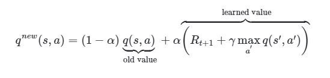

La Qtable est formé sous forme de dictionnaire récursif de N+1 dimension, N étant le nombre total de ligne visible.
L'idée est de fusionner ensemble les clés communes afin de ne pas consommer trop de mémoire vive (on peut avoir plus de
5 millions de clés différentes). La première dimension représente la première ligne visible, la deuxième dimension la
seconde, ... La dernière dimension représente les actions possibles.

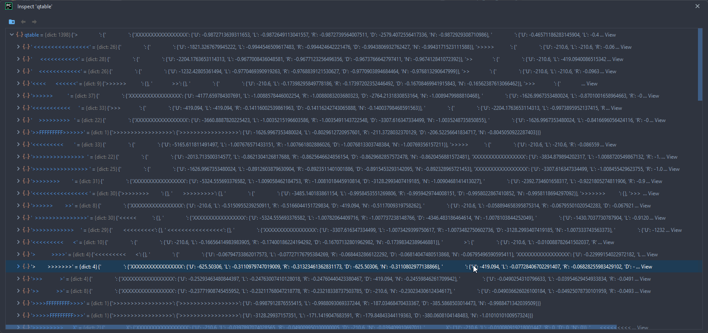

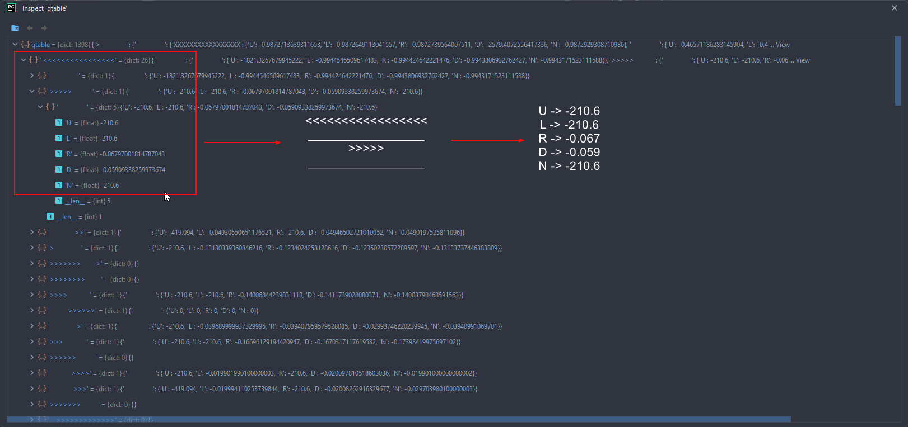

#### Apprentissage

Nous avons testé différents hyper-paramètres pour l'apprentissage sur plusieurs heures.
Les résultats les plus convaincants ont été obetnus avec les paramètres suivants :

- `AGENT_GAMMA = 0.1`
- `AGENT_LEARNING_RATE = 0.6`
- `AGENT_VISIBLE_COLS_ARROUND = 4`
- `AGENT_VISIBLE_LINES_ABOVE = 2 # 1`
- `EXPLORE_RATE = 0.1`
- `EXPLORE_RATE_DECAY = 0.9999`

Nous avoisinons un taux de réussite plus haut (~95%) avec une ligne visible devant contre ~90% avec 2 lignes visibles.
Cependant, nous avont remarqué que les mouvements de la grenouille étaient plus fluides avec 2 lignes visibles, car une
meilleure anticipation.


Les pics sont dûs au rechargement du taux d'exploration (1x par heure)

### Multi Q-Learning

Lors de l'apprentissage par le Q-Learning, nous avons remarqué que nous avions beaucoup d'états différents, plusieurs
millions. Pourtant, beaucoup d'état sont similaires, ont des lignes identiques, mais sont consiédérés comme des états
différents.

Dans le cas où nous avons 4 lignes visibles, ainsi que 4 colonnes visibles.
Pour 5 tokens différents, avec une grille de (17x4) 68 cases, nous avons en théorie 68^5 = 1,453,933,568 possibilités
max, ce qui est GIGANTESQUE.

Pour résoudre ce problème, nous avons implémenté le Multi Q-Learning. Cette méthode consiste à séparer notre unique
Qtable en 3 :

- Une Qtable pour les lignes du haut, ne gérant que l'action de monter
- Une Qtable pour les lignes du bas, ne gérant que l'action de descendre
- Une Qtable pour la ligne centrale, ne gérant que les actions de gauche, droite ou de rester

À chaque itération, nous fusionnons la liste d'action possible en fonction de l'environnement donnée.

Ainsi, nous réduisons le nombre d'états possible (pour la même configuration) à (2x17)^5 + 17^5 + 17^5 = 48,275,138
possibilités max, ce qui est beaucoup plus raisonnable.

#### Implémentation

L'implémentation du Multi Q-Learning est géré par la classe [`MultiQtable`](./ai/MultiQtable.py). Cette dernière
permet de gérer les 3 Qtables, de mettre à jour les valeurs de la table, de récupérer la meilleure action à effectuer,
de sauvegarder les tables de Q-Learning, ...

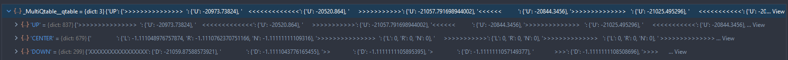

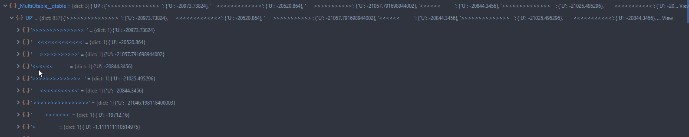

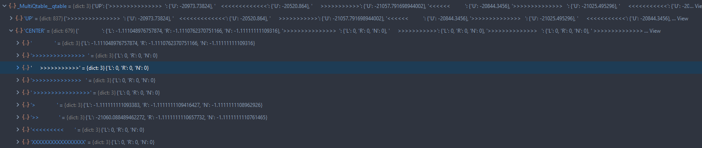

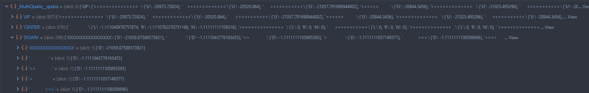

Cette classe permet également (comme les autres méthodes d'apprentissage) de gérer l'exploration et l'exploitation,
ainsi que l'historique de progression.

La classe est sensiblement la même que celle du Q-Learning, à la différence que nous avons 3 Qtables, que nous
fusionnons au moment où il est nécéssaire et récupérer / mettre à jour le poids des actions selon un état donné.

```python
from typing import Dict

from ai.Model import Model
from conf.config import ACTION_UP, ACTION_DOWN, ACTION_LEFT, ACTION_RIGHT, ACTION_NONE


class MultiQtable(Model):
  def __init__(self, alpha: float, gamma: float, score_history_packets: int, visible_lines_above: int):
    self.__visible_lines_above = visible_lines_above
    self.__qtable: Dict[str: Dict[str: float]] = {"UP": {}, "CENTER": {}, "DOWN": {}}
    # ...

  def get_state_actions(self, state: [str]) -> Dict[str, float]:
    actions = {}
    up_state = "\n".join(state[:self.__visible_lines_above])
    center_state = "\n".join(state[self.__visible_lines_above:self.__visible_lines_above + 1])
    down_state = "\n".join(state[self.__visible_lines_above + 1:self.__visible_lines_above + 2])

    if up_state not in self.__qtable["UP"]:
      self.__qtable["UP"][up_state] = {ACTION_UP: 0}
    up = self.__qtable["UP"][up_state]

    if center_state not in self.__qtable["CENTER"]:
      self.__qtable["CENTER"][center_state] = {
        ACTION_LEFT: 0, ACTION_RIGHT: 0, ACTION_NONE: 0}
    center = self.__qtable["CENTER"][center_state]

    if down_state not in self.__qtable["DOWN"]:
      self.__qtable["DOWN"][down_state] = {
        ACTION_DOWN: 0}
    down = self.__qtable["DOWN"][down_state]

    actions.update(up)
    actions.update(center)
    actions.update(down)

    return actions

  def update_state(self, state: [str], max_q: float,
                   reward: float,
                   action: str):
    qtable = self.get_state_actions(state)
    new_q = (1 - self.__alpha) * qtable[action] + self.__alpha * (reward + self.__gamma * max_q)

    if action == ACTION_UP:
      up_state = "\n".join(state[:self.__visible_lines_above])
      self.__qtable["UP"][up_state][action] = new_q
    elif action == ACTION_DOWN:
      down_state = "\n".join(state[self.__visible_lines_above + 1:self.__visible_lines_above + 2])
      self.__qtable["DOWN"][down_state][action] = new_q
    else:
      center_state = "\n".join(state[self.__visible_lines_above:self.__visible_lines_above + 1])
      self.__qtable["CENTER"][center_state][action] = new_q

    self.__increment_step_count()
```

#### Apprentissage

Nous avons testé différents hyper-paramètres pour l'apprentissage sur plusieurs heures.
Les résultats les plus convaincants ont été obetnus avec les paramètres suivants :

- `AGENT_GAMMA = 0.1`
- `AGENT_LEARNING_RATE = 0.6`
- `AGENT_VISIBLE_COLS_ARROUND = 4 # 6`
- `AGENT_VISIBLE_LINES_ABOVE = 2 # 1`
- `EXPLORE_RATE = 0.1`
- `EXPLORE_RATE_DECAY = 0.9999`

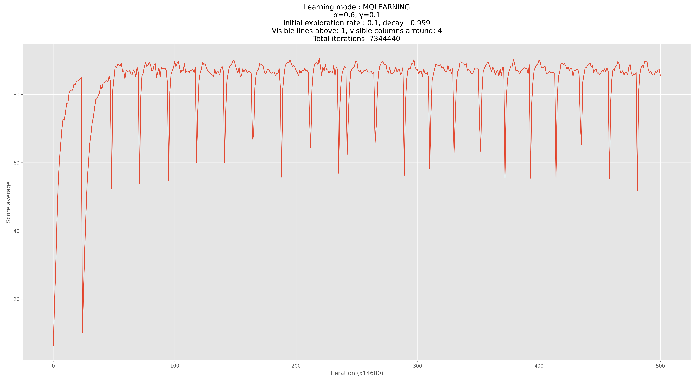

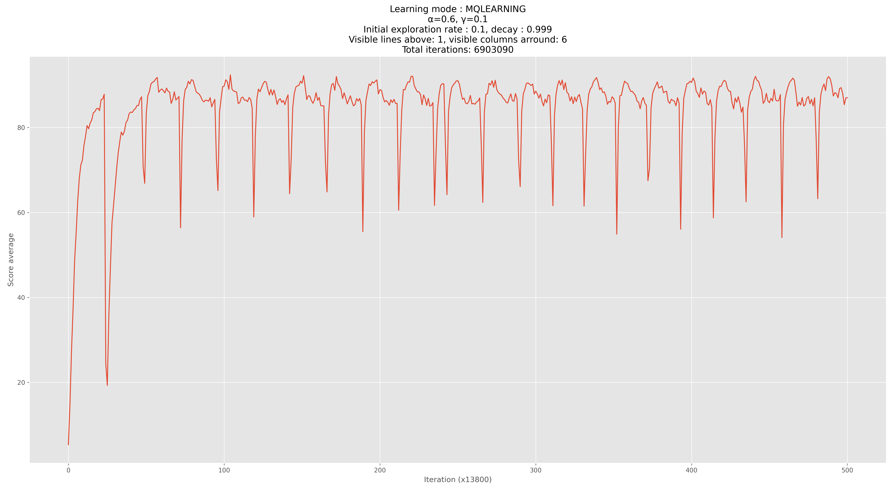

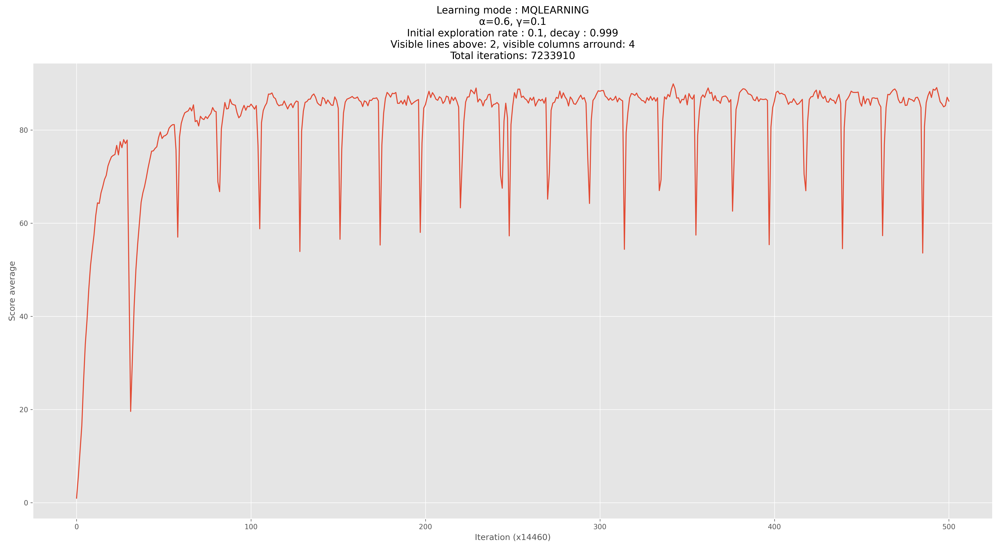

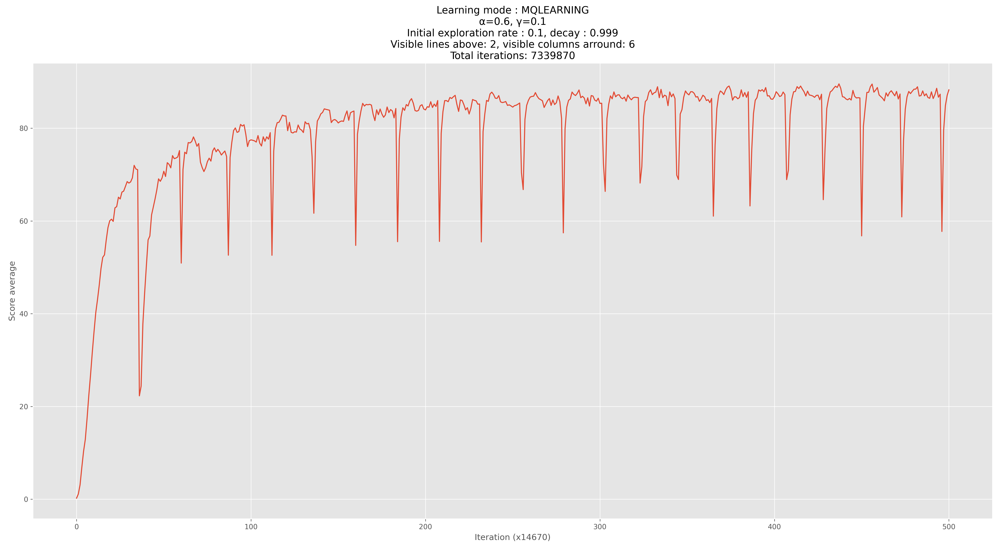

Les pics sont dûs au rechargement du taux d'exploration (1x par heure)

### Deep Q-Learning

#### Implémentation

#### Apprentissage

#### Apprentissage avec modèle pré-entrainé (Q-Learning)

## Apprentissage continu

Pour être capable d'apprendre toutes les possibilités, qui peuvent être nombreuses, nous avons besoin de laisser tourner
l'apprentissage pendant plusieurs heures, voire plusieurs jours.

Cela nous ralentit dans la recherche du bon algorithme, des bons paramètres...
Nous avons donc mis en place tout un tas d'amélioration de performances pour pouvoir faire tourner l'apprentissage plus
rapidement. Nous avons également mis en place un système permettant de faire tourner en mode non graphique (pour plus de
performances) lors de l'apprentissage afin de laisser tourner ce dernier en arrière-plan.

### Docker

Nous avons mis en place un environnement docker pour pouvoir faire tourner l'apprentissage dans un container.
Cela nous donne une grande souplesse dans le lancement de nos apprentissages, il suffit juste de changer les avriables
d'environnement.

## Problèmes rencontrés

### Implémentation du jeu

### Apprentissage

### Performances

### Taille des Qtables

## Conclusion
